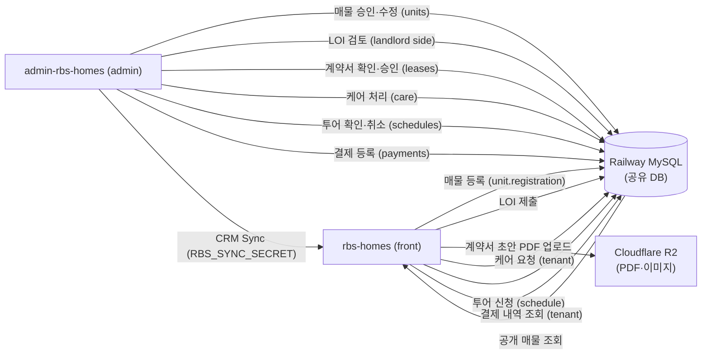

# 정보 구조(IA) / 사이트맵

> **단계**: 1단계 — IA·사이트맵 (목록화만)
> **작성일**: 2026-07-29
> **대상 레포**: rbs-homes (front) + admin-rbs-homes (admin)
> **다음 단계**: 2단계 와이어프레임, 3단계 화면설계서

---

## 1. rbs-homes (공개 사이트) 사이트맵

> 루트 경로: `https://rbs-homes.com`
> Next.js App Router 구조: `app/(route)/` 하위

```mermaid
graph TD
  ROOT["rbs-homes.com"]

  ROOT --> PUBLIC["공개 (비로그인 포함)"]
  ROOT --> MEMBER["로그인 필요"]

  %% 공개 영역
  PUBLIC --> HOME["/ — 홈"]
  PUBLIC --> LIST["/(route)/list — 매물 목록 (임대·매매)"]
  PUBLIC --> RENT["/(route)/unit/rent — 임대 매물 목록"]
  PUBLIC --> BUY["/(route)/unit/buy — 매매 매물 목록"]
  PUBLIC --> DETAIL["/(route)/properties/[slug] — 매물 상세"]
  PUBLIC --> MAP["/(route)/map — 지도 보기"]
  PUBLIC --> SELL["/(route)/sell — 매물 등록 안내"]
  PUBLIC --> POLICY["/(route)/policy — 개인정보처리방침"]
  PUBLIC --> TERMS["/(route)/terms — 이용약관"]
  PUBLIC --> PRESALE["/(route)/presale — 분양(예정)"]

  %% 로그인 공통
  MEMBER --> ACCOUNT["/(route)/account — 마이페이지"]
  ACCOUNT --> MGMT["account/management — 계정 정보"]
  ACCOUNT --> MSGS["account/messages — 메시지함"]
  ACCOUNT --> SCHED["account/schedule — 투어 일정"]

  %% 매물 관리 (landlord·agent: level 2~4)
  MEMBER --> MYUNIT["account/unit — 내 매물 관리"]
  MYUNIT --> MYLIST["unit/my-list — 내 매물 목록"]
  MYUNIT --> REG["unit/registration — 매물 등록"]
  REG --> REG1["step-one — 기본 정보"]
  REG --> REG2["step-two — 상세 정보"]
  REG --> REG3["step-three — 사진·설명"]
  REG --> AIENTR["ai-entry — AI 도움 입력"]
  REG --> REVIEW["review — 검토·제출"]
  MYUNIT --> EDIT["unit/edit/[id] — 매물 수정"]
  MYUNIT --> FAV["unit/favorites — 즐겨찾기"]

  %% LOI · Contract (level 2~3: agent·landlord broker)
  MEMBER --> LOI["loi — LOI 목록"]
  LOI --> LOINEW["loi/new — LOI 작성"]
  LOI --> LOID["loi/[id] — LOI 상세·서명·액션"]
  MEMBER --> CD["contract-draft — 계약서 초안 목록"]
  CD --> CDNEW["contract-draft/new — 초안 작성"]
  CD --> CDD["contract-draft/[id] — 초안 상세·PDF 업로드"]

  %% 역할별 대시보드
  MEMBER --> DASH["dashboard — 역할 대시보드"]
  DASH --> TDASH["dashboard/tenant — 세입자 홈"]
  TDASH --> TPAY["tenant/payments — 납부 내역"]
  TDASH --> TCARE["tenant/care — 케어 요청"]
  TDASH --> TCOMM["tenant/community — 커뮤니티"]
  DASH --> LDASH["dashboard/landlord — 임대인 홈"]
  LDASH --> LLEASE["landlord/leases — 임대 계약 목록"]
  LDASH --> LPAY["landlord/payments — 수납 내역"]
  DASH --> ADASH["dashboard/agent — 중개인 홈"]
  ADASH --> ATOUR["agent/tour-requests — 투어 요청 관리"]
  DASH --> BDASH["dashboard/buyer — 구매자 홈"]
  BDASH --> BINQ["buyer/inquiries — 구매 문의 내역"]
```

### 역할(level)별 기본 라우팅 / 의도된 UX 흐름

> ⚠️ **주의 — 기술적 강제 차단이 아닌 의도된 UX 흐름입니다.**
> middleware.ts가 실제로 막는 경로는 `account/unit/registration`, `account/unit/my-list` 두 곳뿐이며 (level 1 또는 phone 미등록 시 → account/management 리다이렉트),
> 나머지 대시보드 등은 **세션 유무(로그인 여부)만 체크**합니다. 직접 URL 접근 시 어떤 level이든 로그인만 되면 기술적으로 접근됩니다.

| 화면 | 비로그인 | level 1 (일반) | level 2 (agent) | level 3 (broker) | level 4 (owner) | level 5 (tenant) |
|---|:---:|:---:|:---:|:---:|:---:|:---:|
| 홈·목록·상세 | ✅ | ✅ | ✅ | ✅ | ✅ | ✅ |
| 지도·약관·정책 | ✅ | ✅ | ✅ | ✅ | ✅ | ✅ |
| 마이페이지·메시지·일정 | — | ✅ | ✅ | ✅ | ✅ | ✅ |
| 매물 등록·수정 | — | 🚫 미들웨어 차단 | ✅ | ✅ | ✅ | ✅ |
| LOI·계약 초안 | — | ✅ (의도 외) | ✅ (의도) | ✅ (의도) | ✅ (의도 외) | ✅ (의도 외) |
| 세입자 대시보드 | — | ✅ (의도 외) | ✅ (의도 외) | ✅ (의도 외) | ✅ (의도 외) | ✅ (의도) |
| 임대인 대시보드 | — | ✅ (의도 외) | ✅ (의도 외) | ✅ (의도 외) | ✅ (의도) | ✅ (의도 외) |
| 중개인 대시보드 | — | ✅ (의도 외) | ✅ (의도) | ✅ (의도) | ✅ (의도 외) | ✅ (의도 외) |
| 구매자 대시보드 | — | ✅ (기본 목적지) | ✅ (의도 외) | ✅ (의도 외) | ✅ (의도 외) | ✅ (의도 외) |
| /dashboard 기본 목적지 | — | /dashboard/buyer | /dashboard/agent | /dashboard/agent | /dashboard/landlord | /dashboard/tenant |

---

## 2. admin-rbs-homes 사이트맵

> 루트 경로: `https://admin-rbs-homes.com` (또는 내부 관리자 URL)
> Next.js App Router 구조: `app/(route)/` 하위

```mermaid
graph TD
  AROOT["admin-rbs-homes"]

  AROOT --> LOGIN["login — 관리자 로그인"]
  AROOT --> ADMIN["(route) — 관리자 레이아웃"]

  ADMIN --> ADASH["/ (dashboard) — 대시보드 홈"]

  %% 매물 관리
  ADMIN --> UNITS["units — 매물 목록·검색"]
  UNITS --> UDETAIL["units/detail/[id] — 매물 상세 (탭 레이아웃)"]
  ADMIN --> ADDUNIT["add-unit — 매물 직접 등록"]

  %% 계약·임대·결제
  ADMIN --> LEASES["leases — 임대 계약 목록"]
  LEASES --> LDETAIL["leases/[id] — 계약 상세"]
  ADMIN --> PAYMENTS["payments — 결제 내역"]
  ADMIN --> CARE["care — 케어 요청 목록"]
  ADMIN --> COMMUNITY["community — 커뮤니티 게시판"]

  %% 사용자 관리
  ADMIN --> USERS["users — 사용자 목록"]
  USERS --> UUDETAIL["users/detail/[id] — 사용자 상세"]
  ADMIN --> VISITORS["visitors — 방문자 통계"]

  %% 마케팅·콘텐츠
  ADMIN --> BANNERS["banners — 배너 관리"]
  ADMIN --> FEATURED["featured — 추천 매물"]
  ADMIN --> POPUP["popup — 팝업 관리"]
  ADMIN --> PRESALE_A["presale — 분양 관리 ※"]

  %% 커뮤니케이션
  ADMIN --> MSGS_A["messages — 메시지"]
  MSGS_A --> MSGLIST["messages/list — 메시지 목록"]
  MSGS_A --> MSGSEND["messages/send — 메시지 발송"]
  MSGS_A --> MSGTMPL["messages/templates — 템플릿 관리"]
  ADMIN --> CONTACT["contact — 문의 접수"]
  ADMIN --> COMPLAIN["complain — 민원·불만 접수"]
  ADMIN --> SCHED_A["schedules — 투어 일정 관리"]

  %% 시스템
  ADMIN --> SETTINGS["settings — 설정"]
```

> ※ **presale**: admin에 관리 화면이 구현되어 있으나 front(rbs-homes)에는 아직 공개되지 않음 (사전 준비용).

### 관리자 레벨별 접근 요약

| 화면 | level 1 (슈퍼) | level 2 (agent) | level 3 (landlord broker) | 비고 |
|---|:---:|:---:|:---:|---|
| 대시보드 | ✅ | ✅ | ✅ | |
| 매물 목록·상세 | ✅ | ✅ | 담당분만 | |
| 매물 직접 등록 | ✅ | ✅ | — | |
| 임대 계약·결제·케어 | ✅ | ✅ | ✅ | |
| 사용자 관리 | ✅ | — | — | superadmin |
| 배너·팝업·추천 | ✅ | — | — | superadmin |
| 메시지 발송·템플릿 | ✅ | ✅ | — | |
| 문의·민원·일정 | ✅ | ✅ | ✅ | |
| 설정 | ✅ | — | — | superadmin |

---

## 3. 두 사이트 간 연결점

### 주요 연결 흐름 요약

| 워크플로 | front 화면 | admin 화면 |
|---|---|---|
| 매물 등록·승인 | `unit/registration` | `units/detail/[id]` |
| 투어 예약·확인 | `account/schedule` | `schedules` |
| LOI → 계약 서명 | `loi/[id]` (서명 포함) | (향후 admin 연동) |
| 계약서 초안 업로드 | `contract-draft/[id]` | `leases/[id]` |
| 케어 요청·처리 | `dashboard/tenant/care` | `care` |
| 납부 조회 | `dashboard/tenant/payments` | `payments` |
| 메시지 수신 | `account/messages` | `messages/send` |
